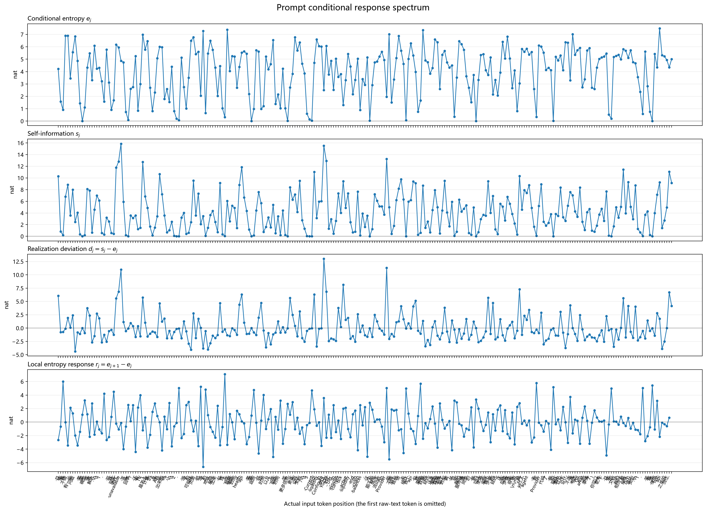
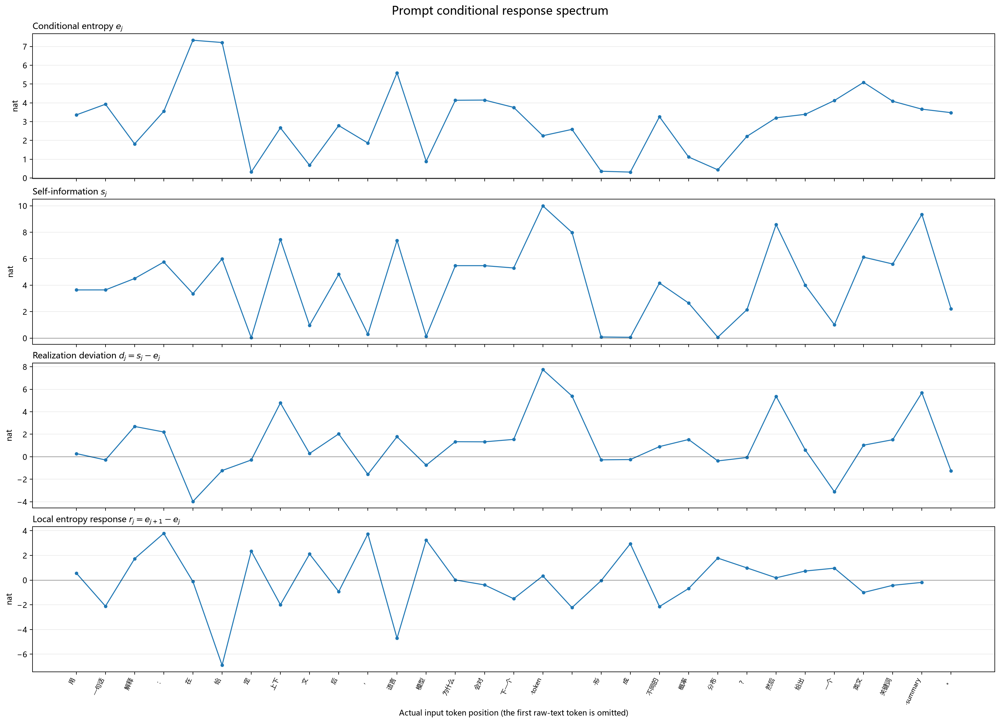
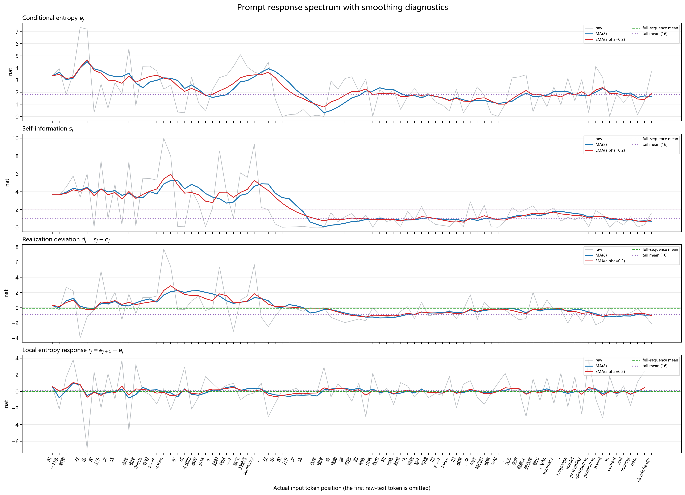
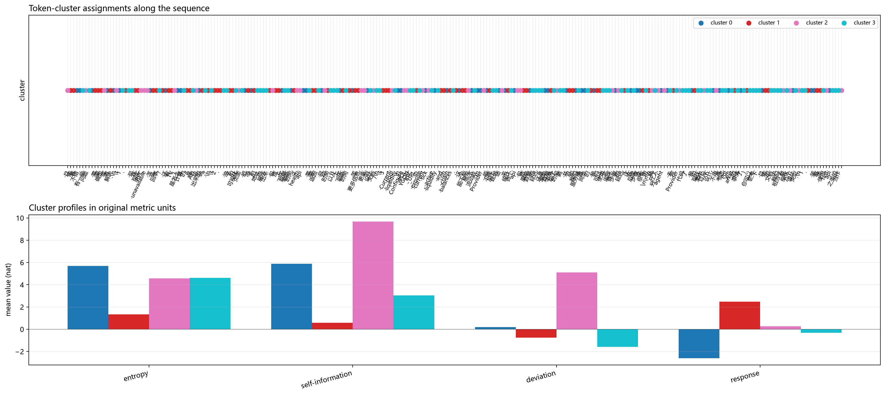

# 熵可以告诉我们什么？一次从兴奋到放弃的尝试

## 1. 事情是从一个概率题开始的

前段时间，我和 GPT 聊到了一个概率题：老王有两个孩子，其中至少有一个是星期三出生的男孩，另一个也是男孩的概率是多少？这个问题第一眼看起来挺无聊的，星期三和性别有什么关系，另一个孩子是男孩的概率不就是一半吗？但是答案却是 \(13/27\)。

我当时觉得奇怪的也正是这里。出生在星期几，和是男孩还是女孩，不应该是独立的吗？为什么多了一条看起来完全无关的信息，结果就变了？

先把问题说清楚。这里假设每个孩子是男孩、女孩的概率各一半，出生在一周七天的概率相同，星期与性别独立，两个孩子之间也独立。为了不把不同情况混在一起，我们按照老大、老二区分两个孩子。那么每个孩子有 \(2\times7=14\) 种等可能状态，两个孩子一共有 \(14^2=196\) 种组合。

设 \(A\) 表示“至少有一个孩子是星期三出生的男孩”，\(B\) 表示“两个孩子都是男孩”。\(P(B\mid A)\) 就是我们要计算的条件概率：已经知道 \(A\) 成立之后，\(B\) 成立的概率。

这就是问题的核心:“至少有一个孩子是星期三出生的男孩”应该按照“从所有二孩家庭里，筛选出至少有一个星期三男孩的家庭”来理解，这个条件事件,改变了概率空间.两件事情依然是独立的,但是两件独立的事情被一起提起的时候,概率空间变了.想明白这点,后面就清晰了.

满足 \(A\) 的组合有多少？反过来数就简单了。每个孩子排除“星期三男孩”之后还剩 13 种状态，所以两个孩子都不满足这个条件的组合有 \(13^2\) 种。再看两个都是男孩的家庭：共有 \(7^2\) 种生日组合，去掉两个男孩都不是星期三出生的 \(6^2\) 种。因此：

\[
P(B\mid A)
=\frac{7^2-6^2}{14^2-13^2}
=\frac{13}{27}
\approx48.15\%.
\]

它确实很接近一半，但还不到一半。如果只知道“至少有一个男孩”，同样按家庭筛选，剩下的是男男、男女、女男三种情况，两个都是男孩的概率则是 \(1/3\)。

这里最有意思的地方，是我们到底怎么得到这条信息。如果事先指定老大，然后知道“老大是星期三出生的男孩”，老二是男孩的概率仍然是一半。可是“这家至少有一个星期三男孩”，筛选的是整个家庭。两个男孩的家庭有两次机会满足条件，一男一女的家庭只有一次，留下来的家庭比例自然就不一样了。

所以，独立性本身没有出问题。我们虽然从同一个原始分布出发，但问的已经是不同条件下的问题。星期三也没有神奇地影响另一个孩子的性别；变化的是，在知道这条信息之后，我们应该怎样给各种家庭组合重新分配概率。

我觉得这个地方挺有意思。平时我们说“多知道了一条信息”，很容易把它下意识理解成某个独立的样本,而不影响别的样本。但这个例子告诉我们,概率空间的改变,后续分布的变化可能比我们想象的要复杂。沿着这个想法往下想，我就开始觉得：这件事和 LLM 好像也有点关系,LLM的生成行为,不就是在不断变化的概率空间下生成吗,这能否给我们带来新的启发?比如我们有办法来刻画这种概率空间的变化吗?理论上联合概率可以按照任意顺序分解,但是在实际生成中,模型是从左到右的,这种不同的空间划分该如何刻画？

## 2. 那 LLM 不也是在不断增加条件吗？

LLM 每生成一个 token，就会把它接到已有文本后面，再预测下一个 token。这里的 token 可以先理解成模型处理文本的小片段，可能是一个字、一个词，也可能只是词的一部分。

从这个角度看，生成过程确实很像刚才那个问题：我们不断知道新的信息，然后重新考虑，接下来可能发生什么。

稍微写一点公式。用大写的 \(X_1,\ldots,X_T\) 表示一段长度为 \(T\) 的随机 token 序列，用小写的 \(x_1,\ldots,x_T\) 表示某一条具体文本。\(x_{<t}\) 表示第 \(t\) 个位置之前的context，\(P\) 表示我们正在讨论的联合概率分布。概率的链式法则告诉我们：

\[
P(x_{1:T})
=\prod_{t=1}^{T}P(x_t\mid x_{<t}).
\]

也就是：一整段文本的概率，可以拆成第一个 token 的概率，乘上知道第一个之后第二个的概率，再乘上知道前两个之后第三个的概率，一直乘下去。第一个位置还没有前文，对应的就是 \(P(x_1)\)。

但这个拆法其实不只有一种。只看三个位置，完全可以正着拆，也可以反着拆：

\[
\begin{aligned}
P(x_1,x_2,x_3)
&=P(x_1)P(x_2\mid x_1)P(x_3\mid x_1,x_2)\\
&=P(x_3)P(x_2\mid x_3)P(x_1\mid x_2,x_3).
\end{aligned}
\]

这个地方让我产生了第一个想法：最后描述的是同一个联合事件，但中间每一步已经知道什么、还需要预测什么，可以很不一样。那不同的拆解过程，是不是会把“不确定性”分配到不同的步骤里？有的步骤可能很好猜，有的步骤可能一下出现很多选择。只看最后那个乘积，这些过程中的区别就看不见了。

不过这里得把两件事分开。上面的等式是在同一个分布里，用不同顺序揭示同一段文本的内容。把一句话的词序真的打乱再喂给模型，输入就变了，不再只是同一个概率的另一种拆法。我们平时用的自回归模型，直接提供的是从左到右的条件概率；公式允许反着分解，也不代表这个模型可以直接、低成本地给出那些反向条件概率。

下面就固定一个模型。用 \(\theta\) 表示模型参数，用 \(Q_\theta\) 表示它给出的概率分布。这样写是为了提醒自己：我们看到的是这个模型对语言的判断，不是某个已知的、绝对正确的语言分布。

真正让我感兴趣的是它从左到右读文本时的变化。如果把所有可能的完整文本放在一起，前缀每确定一部分，与它兼容的完整文本就少一部分。不过，接下来那个 token 的分布不一定会越来越集中。固定搭配中间可能几乎没有悬念，到了“例如：”后面，又可能有很多种接法。

所以我想看的，是这一路上概率分布怎么变：哪些位置比较确定，哪些位置比较开放，同一个词放到不同上下文里又会怎样。能不能给这件事找一个方便观察的量？

## 3. 从概率分解走到熵率

最直接的办法，当然是看概率。但如果句子越来越长，整段文本的概率会因为不断相乘而迅速变小。我们真正想知道的，不只是这个乘积最后有多小，而是怎样把一个整体量拆成每一步的条件量，并用它比较不同长度的序列。

概率本身已经给出了第一种拆法。对于长度为 \(T\) 的随机 token 序列 \(X_{1:T}\)，链式法则写成：

\[
Q_\theta(x_{1:T})
=\prod_{t=1}^{T}Q_\theta(x_t\mid x_{<t}).
\]

但这个乘积会随着长度增加而变得很小。于是我想换一个问题：既然概率可以按条件概率逐步分解，那么对应的不确定性，能不能也按同样的条件结构分解？

可以。用 \(H_{Q_\theta}\) 表示模型分布下的 Shannon 熵，有熵的链式法则：

\[
H_{Q_\theta}(X_{1:T})
=\sum_{t=1}^{T}H_{Q_\theta}(X_t\mid X_{<t}).
\]

这里的 \(H_{Q_\theta}(X_t\mid X_{<t})\) 是对所有可能前缀取平均后的条件熵。它和概率的拆分很像，但从乘法变成了加法：整体不确定性由每一步在当前条件下贡献的不确定性累加而成。

如果把某一个具体前缀记作 \(c\)，模型在这个前缀后给出的 next-token 分布为 \(Q_\theta(v\mid c)\)，那么对应的条件熵就是

\[
H_{Q_\theta}(X_t\mid X_{<t}=c)
=-\sum_{v\in\mathcal V}Q_\theta(v\mid c)\ln Q_\theta(v\mid c).
\]

对所有可能的前缀再按它们出现的概率取平均，就得到上面链式法则中的 \(H_{Q_\theta}(X_t\mid X_{<t})\)。

如果这个随机过程的熵率极限存在，可以定义：

\[
h_\theta
=\lim_{T\to\infty}\frac{1}{T}H_{Q_\theta}(X_{1:T}).
\]

熵率描述的是平均每个 token 的不确定性。总熵可以随着序列长度增长，而除以长度之后的量有机会稳定下来。这正是我当时觉得它比原始概率更适合作为整体参照的原因。

当然，“有机会稳定”不能直接写成“必然收敛”。经典的熵率存在结论通常依赖平稳等条件；一条 Prompt 后的 LLM 生成过程是否满足这些条件，需要单独检验。这里先把熵率当作一种有用的组织方式：它让整体量和逐步条件量处在同一个分解框架里。

接下来要做的，是把这个关于随机序列的框架落到一条已经写好的具体文本上。

### 从随机序列到一条具体样本

到这里，我们讨论的还是用随机变量表示的整段序列：先定义联合分布，再把它拆成一连串条件概率。可真正想做实验时，手上通常只有一条已经写好的文本。那我们能不能沿着这条样本序列，计算出一组量来评价它在模型概率空间中的位置？

单条文本本身是一个已经实现的样本，它不会自动拥有一个 Shannon 熵。熵属于分布。好在语言模型正好会在每个前缀后给出一个 next-token 概率分布，我们可以沿着这条样本逐步读取这些分布，再分别计算它们的熵和实际 token 的自信息。

设 \(\mathcal V\) 是模型的词表，\(v\) 是其中任意一个候选 token。在固定前缀 \(x_{<t}\) 下，把下一步的分布简写成 \(q_t(v)=Q_\theta(v\mid x_{<t})\)。实际出现的 token \(x_t\) 的自信息仍记为

\[
s_t=-\ln q_t(x_t).
\]

定义这一步的预测熵 \(e_t\)：

\[
e_t=-\sum_{v\in\mathcal V}q_t(v)\ln q_t(v).
\]

可以把它和刚才的 \(s_t\) 放在一起理解。\(s_t\) 只看“实际出现的这个 token 有多意外”；\(e_t\) 则把所有候选都考虑进去，按照各自概率，算一下平均会有多意外。

例如，模型有十个等可能的选择，预测熵就是 \(\ln10\)；如果只有两个等可能的选择，就是 \(\ln2\)。所以它很适合描述“这一步有多少不确定性”。但它不负责判断答案对不对。模型非常确定地说错一句话，熵也可以很低。

所以，“只有一条文本”并不是问题。我们不是用这条文本的词频去猜一个分布，而是把它当作一条路径：每读入一个前缀，就记录模型在这个位置给出的分布及其熵；同时记录这条路径实际走向的 token 有多少自信息。

原始讨论里还有一个特别容易让人兴奋的推导。假设 \(t<T\)，我们比较“还没读到第 \(t\) 个 token 时，从这里到结尾的整段熵”和“已经把第 \(t\) 个 token 单独拿出来之后，后面那一段的熵”。链式法则给出：

\[
\begin{aligned}
&H_{Q_\theta}(X_{t:T}\mid X_{<t})
-H_{Q_\theta}(X_{t+1:T}\mid X_{1:t})\\
&\qquad=H_{Q_\theta}(X_t\mid X_{<t}).
\end{aligned}
\]

当时看这个等式，很容易冒出一句话：原来一个 token 带来的“未来熵下降”，恰好就是它自己的条件熵！那这不就能用来描述它的影响了吗？

但这个等式实际做的是一笔拆账：左边第一项统计的是“当前 token 加上后文”，第二项统计的只是“后文”。两项的对象长度不一样，所以差出来的条件熵只是链式分解中的一项，不能直接解释成“这个 token 让后文变得确定了多少”。

如果问题改成“在同一段后文上，知道当前 token 之前和之后，不确定性差了多少”，就要把两边都固定为 \(X_{t+1:T}\)：

\[
\begin{aligned}
&I_{Q_\theta}(X_t;X_{t+1:T}\mid X_{<t})\\
&=H_{Q_\theta}(X_{t+1:T}\mid X_{<t})
-H_{Q_\theta}(X_{t+1:T}\mid X_{1:t}).
\end{aligned}
\]

这个量描述的是当前 token 与后文之间的平均信息关联。它已经比“当前 token 自己的条件熵”更接近我们想问的影响，但仍然不是“把 Prompt 里的这个词换掉，任务会好多少”。后一个问题需要反事实编辑和具体任务指标。这个小绕路值得保留，因为它让我们看到：一个公式看起来在描述“未来熵下降”，并不代表它已经完成了对 token 影响的测量。

### 平均自信息与 perplexity

这个推导还会碰到一个熟悉的东西：困惑度，也就是 perplexity，缩写为 PPL。对于给定文本 \(x_{1:T}\)，常用定义是：

\[
\operatorname{PPL}_\theta(x_{1:T})
=\exp(\bar s_T)
=Q_\theta(x_{1:T})^{-1/T}.
\]

所以，我们刚才从概率乘积走到平均自信息，确实走到了 perplexity 的对数形式。它们不是两个独立指标，指数化只是换了一种刻度。[Perplexity 的定义](https://web.stanford.edu/~jurafsky/slp3/3.pdf)

这里的主体信息是：PPL 是模型给一条具体文本的平均负对数似然的指数形式。它主要用来做长度归一化后的预测评价，数值越低，说明模型在这批文本上平均给出的概率越高。

但 PPL 不能直接替代每一步的预测熵。\(\bar s_T\) 看的是实际走过的那条路径，\(e_t\) 看的是当前位置整个候选分布有多分散；一个是对已实现 token 的评分，一个是对分布的整体描述。至于“PPL 更低是否意味着模型能力更强”，还要看评测数据和任务是否相同，不能只从一个数字推出所有能力。

不过，对我当时的想法来说，PPL 先提供了一个很重要的参照：如果我们能把整段文本的平均信息量当成某种总体水平，也许就可以回头观察每个位置偏离这个水平的程度。

## 4. 条件概率下的 token 信息谱

这才是我当时真正兴奋的地方：如果一段文本的平均预测熵能提供一个整体参照，那么每个位置相对这个参照的偏离，会不会提示我们某些值得注意的结构？

我并没有预先认定重要词一定对应高峰，或者一定让熵下降。高于基准和低于基准都可能有意思。更直接的问题是：偏离得越明显，这个位置是不是越值得看一眼？它会不会对应某种特殊的信息，甚至对后面的生成有比较大的影响？

为了把这个想法写清楚，沿一条固定文本定义平均预测熵 \(\bar e_T\)：

\[
\bar e_T=\frac{1}{T}\sum_{t=1}^{T}e_t.
\]

再用 \(b\) 表示我们选定的参考水平，\(a_t\) 表示第 \(t\) 个位置相对它的偏离：

\[
a_t=e_t-b.
\]

这里的 \(b\) 可以先取整段曲线的均值，也可以取某个参考区间的均值；\(a_t=e_t-b\) 就是第 \(t\) 个位置相对它的偏离。正值表示高于基准，负值表示低于基准，绝对值表示偏离幅度。

这个定义只是在建立一个观察坐标。它没有预设局部值一定会回到基准。即使一条曲线一直在两个水平之间跳动，平均值也可以很稳定；如果基准就是整段均值，偏离之和为零也只是平均数的定义。我们真正要验证的是：较大的偏离是否比其他便宜信号更能提示某种结构或行为变化。

这里还可以看一个很短的式子。设 \(\bar e_{T+1}\) 是多读一个 token 后的新平均值，那么：

\[
\bar e_{T+1}-\bar e_T
=\frac{e_{T+1}-\bar e_T}{T+1}.
\]

这个式子说明，随着已经累计的 token 越来越多，新位置对整体平均值的影响会被长度稀释。因此，平均曲线变平可能只是平均操作的结果，不能单凭这一点判断系统正在恢复平衡，也不能把某个峰谷直接认定为原因。偏离仍然可以作为候选线索，但它是否对应 token 的实际影响，要交给后面的实验。

### 先把它变成能画出来的东西

实际动手时，我没有只盯着相对整段基准的偏离，而是先保留了四个比较容易计算的量。前面定义过的符号继续沿用：\(q_t(v)\) 是模型读到 \(x_{<t}\) 后对候选 \(v\) 的概率，\(x_t\) 是实际出现的 token。

| 量 | 定义 | 我们在看什么 |
| --- | --- | --- |
| 预测熵 \(e_t\) | \(-\sum_{v\in\mathcal V}q_t(v)\ln q_t(v)\) | 当前位置的候选分布有多分散 |
| 自信息 \(s_t\) | \(-\ln q_t(x_t)\) | 实际出现的 token 有多意外 |
| 实现偏差 \(d_t\) | \(s_t-e_t\) | 这次实际出现的 token，比当前分布的平均惊异程度高多少或低多少 |
| 局部熵差 \(r_t\) | \(e_{t+1}-e_t\) | 读入当前 token 后，下一位置的预测熵怎样变化 |

要特别说一下，\(d_t\) 和上面相对整体基准的 \(a_t\) 是两种偏离。前者比较的是同一个位置上的实际选择与平均预期，后者比较的是局部熵与整段参考水平。还有，\(r_t\) 比较的是相邻两个位置的预测熵，也没有直接测量“修改这个 token 会让最终回答怎样”。

这些量有一个挺好的性质：一旦拿到完整词表的 logits，也就是模型给每个候选的原始分数，就能转成概率并计算。对于一条已有文本，可以让模型按它原本的 token 顺序计算各位置分布，不必先反复删除关键词、重新生成回答。这种给定实际序列来计算的方法通常叫 teacher forcing。

但索引得对齐。模型读完第 \(t-1\) 个 token 的输出，才是用来给第 \(t\) 个 token 打分的分布。当前原型的 raw text 路径没有给第一个 token 补一个额外起始前缀，因此从第二个 token 才开始有指标；熵差缺少后一项的位置也会留空。这些看起来只是代码细节，真要把曲线峰谷对应回文本，却很容易差一个位置。

### 每个 token 的数值都由上下文决定

给每个位置附上四个数，再按文本顺序排列，我们就得到四条像时间序列一样的曲线。我当时把它叫作“熵谱”。这里的“谱”只是一个直观叫法，没有做傅里叶变换，横轴就是 token 的位置。

这些数本质上是条件概率的数值：模型在位置 \(t\) 看到的前缀不同，得到的分布就不同；同一个 token 出现在不同的上下文、不同的位置，甚至换一个模型，都可能对应完全不同的数值。后面的 token 还依赖前面已经生成的 token，所以整条序列形成了一条沿时间展开的条件响应轨迹。

因此，我们描述的不是一个脱离语境的“词分数”，而是一个 token 在给定模型、给定前缀和给定位置上的一次表现。真正想找的也不是神奇关键词词表，而是：能不能从这条条件响应轨迹中，发现某些与后续行为相关的结构。

我的期待是，能不能从这些曲线里认出一些模式？比如某些关键词附近有稳定的异常，某些约束语句出现后，曲线就换了一种状态。再往前想一步，如果每个 token 都有一组特征，那能不能聚类，把它们分成几类？这些类会不会刚好和我读文本时感觉到的某种角色对应起来？

甚至不一定一上来就识别“决定模型表现的关键词”。如果能把一些结构边界、某类词或者某种用法比较稳定地挑出来，也已经挺有意思了。

当时把这几步连在一起，确实觉得很顺：概率可以分解，熵可以分解，整体有平均水平，局部有偏离；同一个 token 的分数还天然依赖上下文。公式好算，曲线也好画，看起来各方面都很合理。那最应该做的事情，当然是赶紧跑一下。

## 5. 跑起来以后，图确实挺好看

这次我没有继续在纸上推很久，而是以最快的速度开始了实验。几乎是晚上想到这个 idea，睡前就让 agent 开始配环境和写代码，第二天起床时已经有了初步结果。模型用的是 Qwen2.5-1.5B-Instruct，在本机 8 GB 显存的 RTX 3070 Laptop GPU 上跑，精度是 FP16。先用一个能快速跑通的模型，把曲线画出来再说。

最开始做的事情很简单：输入一段文本，拿到每个 token 对应的四个量，画在同一个横轴上。后面又加了几样东西：比较直接输入原文和套聊天模板的区别；让模型接着往后生成，看看续写部分的曲线；加移动平均和指数移动平均；最后把四个量作为特征做聚类，再给原文着色。

这些工具很容易让人越玩越起劲。只看曲线，还需要不停对着横轴找词；把颜色直接涂回文本之后，哪里数值大、哪里变化明显，一眼就能看到。再加上缩放、调整聚类数和切换指标，探索起来确实很顺手。

图 1：一段较长 Prompt 的四条逐 token 条件响应曲线。横轴是模型实际看到的 token 位置，纵轴单位为 nat。

### 局部规律确实能看到

比如最初的一条输入是：

> 请用一句话解释：在给定上下文后，语言模型为什么会对下一个 token 形成不同的概率分布？然后给出一个英文关键词 summary。

这条输入被分成 32 个 token，原型算出了其中 31 个位置的指标。在保存的结果里，“给定”被拆成了“给”和“定”。预测“给”时的熵大约是 7.212 nat，到了预测“定”时，熵只有 0.317 nat，而实际“定”的自信息约为 0.030 nat。

看到前面的“在给”，模型很容易继续接出“定”。这种局部搭配，曲线确实能抓到。类似地，“语言”和后面的“模型”，对应的预测熵约为 5.600 和 0.888 nat，也能看到很明显的差别。

但这马上带来一个问题：如果一眼看到一个很低的值，我们到底是在看“这个词对任务很重要”，还是“这个词在当前位置很好猜”？这两个例子能支持后者，却还没有回答前者。

图 2：短输入的四条曲线。“给／定”和“语言／模型”附近的局部差异比较明显，但可预测性不等于任务重要性。

<!-- 原始结果：Kitchen/prompt-entropy-spectrum-viz/artifacts/92593c730260008d/spectrum.png；数值来自同目录 metrics.csv。 -->

### 往后生成，看起来像是逐渐稳定了

接着，我让模型在输入之后继续生成，也就是做 rollout。这正好对应最开始那个期待：前面有起伏，后面会不会逐渐表现出某种稳定水平？

在一条保存的短输入实验里，32 个输入 token 后面接了 56 个生成 token。图上同时画了原始曲线、窗口为 8 的移动平均、系数为 0.2 的指数移动平均，以及整段和尾部 16 个位置的均值参考线。视觉上看，续写部分的平滑曲线比输入部分更平一些。

把实际数据按输入和续写分开，均值如下，单位都是 nat：

| 范围 | 有指标的位置数 | 预测熵均值 | 自信息均值 |
| --- | ---: | ---: | ---: |
| 输入部分 | 31 | 3.020 | 4.137 |
| 续写部分 | 56 | 1.626 | 0.919 |
| 输入与续写合计 | 87 | 2.122 | 2.066 |
| 最后 16 个位置 | 16 | 1.827 | 0.954 |

这次运行说明，输入部分和续写部分的统计状态确实不同：续写部分的预测熵和自信息均值都更低。但“看起来更平”还不能被当成熵率已经收敛。整段均值约为 2.122 nat，尾部 16 个位置的均值约为 1.827 nat；参考区间换了，基准也会跟着换。一条有限长度的平滑曲线，最多说明这次续写在后半段比较平稳。

另外，这次续写使用的是 greedy decoding，即每一步都选当前概率最大的 token，而不是从完整分布中随机抽样。这样的选择会让生成出来的 token 更符合模型的直接预期，自信息较低是自然结果。

实际上，如果每次都选同一个分布里概率最大的候选，那么这个候选的自信息，就是所有候选自信息里的最小值，自然不会超过它们的加权平均，也就是预测熵。于是 \(s_t-e_t\) 在这种选择下不会为正。这是选择方式本身就会带来的现象，不能把它解释成模型找到了某种特别好的生成状态。

所以，这张图给出的结论很有限：在这个模型、这条输入和这种解码方式下，续写段的曲线看起来更平，平均值也更低。它还没有回答“无限延长后是否会收敛”，更没有证明模型内部存在一个会把局部偏离拉回去的整体机制。

图 3：短输入加 rollout 的平滑曲线。图中标出了输入与输出的连续轨迹，并保留了整段均值和尾部均值作为参考。参考水平会随选取范围变化，greedy 续写也会影响自信息的表现。

<!-- 原始结果：Kitchen/prompt-entropy-spectrum-viz/artifacts/06ddc1878b0ab719/spectrum_smoothed.png；表格由同目录 metrics.csv 汇总。 -->

### nat、熵率与模型的压缩能力

到这里，nat 这个单位也就有了比较具体的含义。\(s_t\) 用 nat 表示第 \(t\) 个 token 在模型看来包含多少信息；把它们加起来，是模型为整段文本付出的总信息成本；再除以 token 数，就是平均每个 token 的编码成本。

如果一个模型很了解一段文本的规律，它就能给常见的下一个 token 更高概率，平均自信息也会更低。用概率编码的语言来说，这意味着同样的文本可以用更少的平均码长表示。在满足相应条件的真实来源分布中，熵率给出的是理想无损编码所需的平均信息量下限；对一个具体模型来说，平均负对数似然则是按照这个模型的概率分配进行编码时的实际成本。模型分布越接近数据分布，这个成本通常越低。

因此，熵率可以被理解成一种“平均不可压缩信息密度”，而 PPL 只是把这个密度指数化之后的刻度：

\[
\operatorname{PPL}=\exp(\text{平均自信息}).
\]

在一个非常理想化的例子里，如果每一步都像是在 \(K\) 个等可能的候选中选择，那么每步信息量是 \(\ln K\) nat，PPL 就是 \(K\)。所以 PPL 常被直觉地解释成“平均有效候选数”。真实语言当然不是每一步都等可能，PPL 更准确的含义仍然是实际 token 概率倒数的几何平均，而不是模型的 top-1 准确率。

这套思路也不是 LLM 时代才出现的。Shannon 在 1951 年研究 printed English 时，就通过让人根据前文预测下一个字母来估计语言的熵和冗余；他关心的正是平均每个符号产生多少信息，以及语言结构能把文本压缩到什么程度。[Shannon, *Prediction and Entropy of Printed English*](https://onlinelibrary.wiley.com/doi/pdf/10.1002/j.1538-7305.1951.tb01366.x)

后来早期的统计语言模型把同样的思想落实成 n-gram：根据前面若干个词估计下一个词的概率，再用交叉熵或 perplexity 在测试集上比较模型。今天的 Transformer 只是把条件上下文和概率分布建模得复杂得多，评价时仍然会回到这套“每个 token 的平均信息成本”。[Jurafsky 与 Martin 的语言模型章节](https://web.stanford.edu/~jurafsky/slp3/3.pdf)

这也解释了为什么这些量很适合描述模型的整体预测能力，却不一定适合回答更细的问题。它们告诉我们模型平均能把一类文本压到多低的概率编码成本，却没有告诉我们某个具体 token 在某个任务里是否是关键原因。整体压缩能力和局部因果影响，本来就是两个不同层次的问题。

### 但想找的关键结构，并没有自然地冒出来

真正让我泄气的，是把更复杂的文本放进去之后。

简单句、固定搭配和格式变化看起来还挺有规律。换成实际使用的长 Prompt——中英文混在一起，还有代码名和多条要求——颜色很快就混了。我读文本时能分出哪些是要求、哪些是重要概念，但曲线和着色没有把这些角色清楚地挑出来。

聚类也只能处理它拿到的数值。原型把四个指标标准化，再用 K-means 按特征距离分组；它知道哪些点在数值上接近，却不知道什么叫关键词、名词，或者“对后文有影响”。

这条复杂文本实际分析的是截断后的前 256 个 token。去掉第一个没有指标的位置，以及最后一个缺少熵差的位置，最终有 254 个位置参与四类聚类。各组确实有数值差异：例如一组的平均自信息约为 9.677 nat、实现偏差约为 5.099 nat；另一组的平均预测熵约为 1.343 nat、自信息约为 0.579 nat。

但这些组首先对应的是“实际选择很意外”或“模型很好猜”之类的概率特征，不能直接读成“这一组是关键指令，那一组是普通描述”。偶尔从着色里找到几个顺眼的例子，也不等于得到了稳定的语义分类能力。

图 4：复杂 Prompt 的四维 token 聚类结果。数值分组有差异，但颜色没有自然对应到人所理解的语义角色。

<!-- 原始结果：Kitchen/prompt-entropy-spectrum-viz/artifacts/50a58a7a8eeaf9ba/clustering.png；类均值来自同目录 cluster_profiles.csv。 -->

聊天模板的比较还提醒了我：同一句用户问题，直接输入和包装成聊天消息，模型实际看到的前缀并不一样。角色标记、系统消息、生成起始标记都会进入上下文，所以讨论“同一个词在模型里是什么表现”时，必须说明它是怎样送进模型的。

这轮实验只用了一个模型和少量输入，没有人工标注，也没有做受控改词后的任务评分。它没有证明熵谱与关键词影响无关，但确实没有出现我最初期待的结果：几个量画出来、聚一下类，关键词或漂亮的语义结构就自己浮现出来。

## 6. 最后的反转：我们到底想让这几个数做多少事情？

这个结果让我失望，但回头看又并不意外。大模型用很复杂的内部表示给整个词表分配概率。它读到一个 token embedding 后，可能同时调整对主题、语法、格式、语气以及后面答案的预期在多层里面反复表示；而我把这些变化压成几个数，再希望从中读出 token 的语义角色、重要性，甚至它对最终回答的影响。

问题可能不是这些数没用，而是我让它们承担了太多解释工作。

### 熵告诉我有多分散，却没有告诉我在猜什么

先看一个最简单的例子。假设只有三个候选 A、B、C，两个分布给它们的概率分别是：

\[
p=(0.8,0.1,0.1),
\qquad
q=(0.1,0.8,0.1).
\]

这里 \(p\) 和 \(q\) 只是两个假想分布。它们的熵完全相同，因为求和时只是把 0.8 放到了不同的位置；但一个主要预测 A，一个主要预测 B。如果 A、B 对应不同答案，这个变化对任务可能很重要，熵却完全看不出来。反过来，模型在几个意思相近的说法之间犹豫，预测熵可能变大，最终表达的意思却没有明显变化。

熵保留了分布有多集中，却没有保留概率具体分给了谁。自信息补充了实际 token 的概率，但仍然没有留下其余候选之间的完整关系。

用一个简单记号，把每个位置的四个特征写成 \(z_t\)：

\[
z_t=(e_t,s_t,d_t,r_t).
\]

这相当于把高维的条件分布，以及它沿文本变化的一小部分信息，映射成低维数值。不同的分布和上下文，完全可能在这些数上表现得很接近。而且四个坐标也不是四份独立信息：\(d_t=s_t-e_t\)，知道前两个就能算出第三个；\(r_t\) 只是相邻位置熵的差。它们适合做展示，让变化更容易看见，但多画两条曲线，并不会凭空找回已经压掉的信息。

### 低维不是原罪，问题是留下来的信息够不够

我一度想把这类思路整个否定掉：用一两个精巧、带点物理直觉的统计量，去抓住大模型复杂的语义结构，是不是本身就不靠谱？但低维量当然可能有用，关键在于它是否足够回答眼前的问题。

如果我问“模型在这里有多不确定”，预测熵很合适；如果我问“实际 token 有多难猜”，自信息也很合适。可一旦问题变成“这个 token 是否让整段回答更好”，就还要考虑任务目标、上下文、token 之间的相互作用，以及“更好”究竟怎么定义。

“不要”可能很好预测，但删掉它，整句要求会反过来；罕见的专有名词自信息很高，却可能只是一个无关紧要的例子；格式约束的作用，也可能到回答后半段才显现。局部数值和任务影响之间，没有天然的一一对应。

这次失败更准确的说法是：我构造了能回答局部概率问题的量，却期待它们顺便回答复杂的行为问题。中间那座桥还没有搭起来。

### 那训练时的 loss，不也是几个数吗？

想到这里，很自然会反问：训练模型时不也是看 loss 吗？模型再复杂，最后盯的曲线也就几条，为什么这次不行？

一个有意思的角度是，人能从 loss 里看出东西，本身也是训练出来的。同样的曲线，有经验的人会结合数据、学习率和训练阶段判断异常；没做过训练的人可能只看见几条线。统计量是压缩后的信号，人则是靠经验学会解读它们的“解码器”。读图时补进来的，还有这次改了什么、数据从哪里来，以及过去类似曲线最后意味着什么。

优化器真正更新参数时，也不只拿着一个 loss 数值。设 \(L(\theta)\) 是训练损失，它还会使用损失对模型参数的梯度 \(\nabla_\theta L(\theta)\)，也就是各个参数往什么方向改变，会怎样影响损失。这个方向信息可以非常高维。一条标量曲线，是我们观察训练的窗口，不是训练过程拥有的全部信息。

所以，几个统计量当然可以用来观察总体水平、异常和阶段变化；但“能监控系统”和“只凭几条曲线解释每个复杂结构”，需要的信息量完全不同。若要识别 token 的语义角色或它对后文的影响，可能需要保留更多表示，甚至训练一个有足够表达能力的预测器。这次实验还回答不了模型需要多大，只能提醒我先检查表示是否真的包含目标所需的信息。

> 从数学上讲,过度压缩的低维表示,确实难以表示足够复杂的信息.这甚至是所有依赖于人构造的,解释性工作的致命问题.

### 再换个大模型，能救回来吗？

也可能会想：现在只是 1.5B 模型，要不要换个更大的？样本也少，多跑一点会不会就有规律？这个可能性不能排除，更大的模型和更多样本也许能让现象更稳定。

但换模型不会自动解决“统计量是否保留了所需信息”这个问题。如果继续做，我会先把目标收窄，再测试它是否真的有用：固定一类任务，用曲线挑出候选片段，构造尽量匹配的替换或删除对照，实际测回答正确率、格式合规率等指标的变化；然后在没有参与挑选规则的新 Prompt 上，和随机片段、词频或单独的自信息作比较。删除和替换会同时改变语法、长度与语境，对照必须设计好。

如果这个便宜的筛选步骤能更快找到有影响的片段，它就已经有价值，不必把它说成读懂了全部机制；如果没有这个优势，继续放大模型、调整聚类参数，可能只是让探索变贵。

已有工作也用 token 熵研究过生成中的不确定性与局部现象，例如摘要中的复制行为和位置差异。它说明这些量可以服务于明确的问题，但“画出熵曲线”本身并不是一个全新的研究贡献。[Xu 等，2020](https://aclanthology.org/2020.emnlp-main.508/)

对这个项目，我目前更愿意把熵谱留作观察和候选筛选工具：它能告诉我哪里发生了局部概率变化，也能帮我挑出值得检查的位置；至于这些变化意味着什么，仍然要回到具体任务里验证。

## 7. 不过，这一晚上还是挺值的

最后想说的，反而是这次做实验的速度。

当时大概半夜十二点冒出这个想法，一点左右就让 GPT 开始写代码。一晚上把模型和环境配好，第二天早上跑完，结果就让我开始怀疑：它可能根本达不到我想要的效果。

这种反差很明显。前面推的时候越来越觉得合理，甚至兴奋得睡不着；可视化也确实好看。等真正把“想看到的东西”和结果对上，才发现中间有一步根本没有验证。

换作以前，我可能会在这个想法上绕三五天，继续推公式、找物理类比，越想越觉得有道理，最后才搭环境。这次想到以后直接做，第二天就有结果，也就更早看见问题。

所以这次最实在的提醒就是 fail fast：有了一个感觉特别好的 idea，尽快找个最小实验，猛踢它一脚，看它到底站不站得住。尤其是那种每一步都能讲出道理、关键跳跃却没有验证的想法，越容易把自己越推越上头。

这次实验当然很粗：模型小、文本少，而且没有标签。它不足以宣判所有熵相关方法都不行，却足以让我放弃“再调一调就能自动读出关键词”的期待。概率怎样分解，条件怎样改变后面的判断，单条文本和分布的熵有什么区别，整体平均和局部偏离是什么关系——这些问题，反而在这次绕路里变清楚了。

我原本想用几个容易解释的数，看懂模型里不容易解释的东西。跑完以后才发现，真正需要追问的是：这些数保留了什么，我又让它们承担了多少额外的解释？

这一回，熵没有帮我找到想象中的关键词。不过，把一个自己觉得特别有道理的想法，尽快做到能被结果质疑，还是挺值的。
