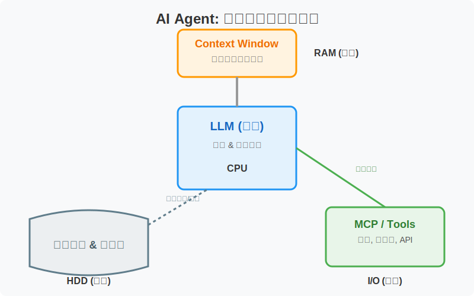
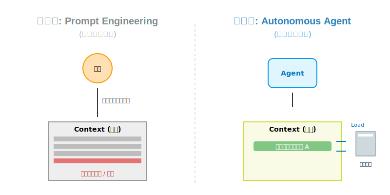

<!-- # AI编程Agent技术调研：从实践到思考

--- -->

## 🧭 引言

本文基于为期一周的深入调研，系统总结了AI编程Agent的技术现状与应用实践。核心研究问题是：**如何有效地利用Agent进行编程开发？** 同时，本文也将分享我对当前Agent技术发展的观察与思考。

---

## 我都做了什么？

在LLM时代，一个重要的洞察是：不应过度纠结于理论和抽象概念，而应尽可能地进行实践尝试。在本周之前，我仍采用传统的AI编程方法，尚未接触最新的Agent理念。然而，通过持续与GPT进行高强度对话，当我转向Agent编程时，许多概念都显得水到渠成。甚至一些我之前试图自行解决的问题，现在发现Agent领域已经出现了成熟的工程化解决方案。

这里简要介绍市面上的AI辅助编程工具，大致可分为两个层次：

- **Copilot类工具**：主要提供代码自动补全和部分代码重写功能。使用这类工具时，编程流程仍较为传统——开发者需要掌握编程框架，由AI辅助进行模块或部分代码的修改。
- **Agent类工具**：以**Claude Code**为代表，其技术能力呈现出断档式的优势。事实上，大多数其他编程工具中效果较好的Agent，实际上也都采用了Claude的模型，例如谷歌的Antigravity和Cursor。

---

## 我最强烈的感受是什么？Context Management

在接触Agent之前，我最强烈的感受是：**大语言模型的表现很大程度上取决于其上下文（Context）。** 与大语言模型协作时，你需要扮演一个"上下文管理者"的角色。无论是为模型提供具体的操作指导（如逐步的执行步骤），还是提供必要的信息和支持条件，都能极大地影响模型的表现水平。

这听起来似乎与过去的提示工程（Prompt Engineering）很相似，某种意义上确实如此。但我个人认为，这更像是一个**人机交互问题**——其核心在于如何通过对上下文的设置和处理来控制模型。当下可改变的对象已远非模型本身，而在于用户应如何与模型进行交互。

在与GPT的高强度对话中，我有两个深刻的感触和相应需求：

1. 我发现当提供特定背景信息时，GPT的表现会有显著差异。如果为问题提供准确的背景信息，GPT会有出色的表现；但如果提供的背景信息不够精确，未能聚焦到具体子问题或领域，GPT的回答就会泛泛而谈，难以切中要害。实际上，GPT掌握着相关信息，但如果你不将相应的上下文提供给它，它不会主动深入特定领域进行探索。

2. 我发现GPT对抽象的命令和要求表现不佳。然而，一旦在之前的对话上下文中，我们对某个问题进行了具体的步骤讨论，GPT的表现就会迅速提升。

当时我非常希望实现一个插件，能够在与GPT或大语言模型对话时，**动态编辑模型的上下文**，提供必要的信息和基本操作步骤。我希望这个工具能像插件一样，在每次对话中随时调用，而不需要像过去那样将提示词（Prompt）硬编码到整个项目中。相反，我希望在具体的对话或任务中按需加载，或在必要时取消相应的上下文指导。

然后在这一周，我发现Claude新推出的Skill功能完美地实现了我想要的需求。

## 什么让我非常感到吃惊？

我去年上半年曾浅尝辄止地接触过Agent相关研究，随后便放弃了。在2025年上半年之前，无论是产品还是研究，Agent领域（尤其是Workflow等方向）都相当混乱.充斥着大量抽象概念和新名词，其方法论本身似乎并不太有效。事实上，现在回顾会发现，当时的许多范式并非最优选择，或者说当前的Agent已经发生了**根本性的范式转变**。

当你实际使用Claude Code时，会发现现在的编程Agent具备了两种**令人震惊的新能力**：

1. **自主规划与任务安排**：模型具备了自主规划和安排任务的能力。
2. **自主上下文管理**：模型能够根据自己的意图决定工具调用，甚至管理上下文。具体来说，在编写代码时，模型不会将整个代码文件或项目中的所有文件都加载到上下文中，而是会自主决定打开哪些文件、查找相关代码，并像人类一样跳跃式地寻找所需代码。

我认为这是Agent最本质的范式变化。与此前需要手动编排规划、管理上下文的人工操作相比，这种转变意义深远。我们潜意识中认为这些操作是人类独有的高级思维能力，但现在模型通过大量数据训练也获得了类似能力。

当然，这并非一蹴而就的结果。事实上，其发展始终有迹可循——从早期的函数调用（function calling）到去年的Agentic RL。但通过调研，我认为这更多是工程迭代产生的奇迹，或者说是一个奇点时刻。相关概念最早可能在2023年就已提出，但归根结底还是模型能力的巨大增强。并非之前的Agent框架无效，而是现在的模型确实强大得多。当所有这些因素结合在一起，就产生了质的变化。其中一个表现就是这项技术已经"出圈"，例如Claude Code迅速普及到大众并产生了巨大影响。

## 自然语言图灵机

基于调研分析，我提出了一个有趣的洞察：**Agent正在变得越来越像一台计算机。**

我们可以用计算机科学中的简洁概念来理解Agent及其相关技术。在这个类比中：

- **上下文（Context）** ≈ 图灵机的纸带 / 计算机的内存
- **Agent本身**（无论是自主规划决策还是人工编排）≈ 在内存上读写的程序 / 在纸带上读写的人

大语言模型驱动的Agent就像是一台基于自然语言运行的图灵机——它读取上下文，然后输出结果并更新上下文。

从这个角度审视Agent相关概念，一切都变得特别清晰：

### 首先Agent如何读写上下文？

这主要体现在两种新出现的能力：**规划（Planning）** 和 **自主加载上下文**的能力。

就像一个程序发现内存中需要的数据在硬盘上时，会自动从硬盘加载数据。之前的Agent可能较为简单，只能决定程序的执行顺序——第一步调用哪个程序、第二步调用哪个程序（即函数调用）。但现在Agent变得更智能，能够自主决定将哪些程序加载到上下文以及决定执行的顺序，甚至主动创建或寻找相应程序，而不再依赖人工硬编码执行顺序。这相当于提升了图灵机中"在纸带上写字的人"的能力。

### 其次上下文的结构越来越像内存?

对于上下文的管理，我们可以借助计算机内存的概念来理解。上下文的内容大致可分为两类：

- **信息类**：类似内存中的数据块（Data Block），提供必要的背景信息
- **执行类**：类似内存中保存一行行代码的程序块（Program Block），描述具体的执行步骤

我认为 **Skill功能** 很好地体现了这种结合——描述问题背景就是提供必要的信息和数据，而描述具体执行步骤则像是用自然语言编程。

### MCP：外部接口协议

至于**MCP（模型上下文协议）**，则是一个典型例子。计算机除了需要访问内存，还需要访问外部接口（如鼠标、键盘等各种设备）。MCP就是这些外部资源的统一接口,对应到计算机就是相应的驱动程序，Agent通过调用MCP来访问这些资源。

### 范式的深层意义

从这个角度讲，Agent的相关概念变得非常清晰易懂。这种范式确实令人震惊：我们竟然真正实现了用自然语言——这种听起来并不严谨的方式——来描述操作、指导执行。Agent在进行判断和推理时，也不像传统程序那样通过严格的流程，而是用自然语言作为自己的思考和推理过程。

不知这能否被称为"智能"，但这种范式确实令人震撼——它越来越接近图灵测试中那个在黑屋里写纸条的人了。

---

## 未来我们可以做什么？

我之前非常不看好Workflow这种范式。后来思考发现这是有道理的：**如果AI本身就不够智能，再往系统中引入更多复杂的AI，只会让整个系统变得更糟糕。** 这属于无端增加系统复杂性，却指望通过手动流程编排来控制整个系统，实际上是自找麻烦。

我认为AI不应该是串联的，也不应该由人来编排。大语言模型Agent的设计更应该像一台**自然语言计算机**，通过内部的语言逻辑来决定自己的操作和任务编排。就像程序和人类的发展一样，也许会发展出越来越特化的小模型和对应的AI，执行特定任务，从通用模型向专用模块转化。但简单的把他们串联在一起并不是最优选择.

未来，我认为有两个非常重要且日益凸显的研究方向：

### 方向一：人机交互方式的革新

在当前系统中，**人似乎已成为瓶颈**。对于某些系统，如果不能完全放任AI自主运行，就需要思考如何让人融入系统，成为有效的控制环节。

就像用VS Code和记事本都能写程序，但更好的界面和交互方式会让整个系统的运行产生质的变化。我在编程中有强烈感受：AI编程速度极快，已经弥补了人类编程的速度问题。因此，**人更应该关注项目管理、整体架构等设计层面的工作**。

在这段时间的体验中，我开始强烈追求**项目规范化**。这并非AI的需求——无论代码多乱，AI都能读懂；但AI生成的代码，人类可能来不及阅读或难以理解。如何良好地管理项目，不得不借助一些人类可以理解的抽象流程。这方面其实在过去已有相当多的实践经验可以借鉴。

### 方向二：AI的自举能力

我认为这将是产生巨大突破的方向：**AI何时能学会利用自身数据提升自己？** 比如自主创造工具、提升自己的能力——或者用一个抽象词来概括：**自举（Bootstrapping）**。

从将AI视为自然语言计算机的角度来看，这似乎已非难事。我们输入的Skill就像程序，让AI学会为自己输出新程序来提升能力，也许就是达成这一范式的可行路径。

我认为这将是**下一次范式的巨大变化**。目前AI还停留在按照人类给出的整体操作进行规划和执行的阶段。也许有一天，AI会将"学习新能力"也视为可以规划和操作的目标——那将又是一次深远的变革。

## 附录：Agent 计算模型的形式化定义

虽然将 AI Agent 比作计算机是一种直观的工程类比，但从计算理论（Theory of Computation）的视角来看，这对应着从**有限状态机（FSM）**向 **图灵机（Turing Machine）** 的范式跃迁。为了更严谨地阐述这一观点，我们可以尝试对 Agent 的运行机制进行形式化描述。

#### 1. 系统定义

我们可以将一个具备自主能力的 Agent 系统 $\mathcal{A}$ 定义为一个四元组：

$$ \mathcal{A} = \langle \Theta, S, \mathcal{E}, \delta \rangle $$

其中：
*   **$\Theta$ (Instruction Set)**: 大语言模型的参数权重。它定义了机器的“固有逻辑”和“指令集”。
*   **$S_t$ (Internal State)**: $t$ 时刻的上下文窗口（Context Window）。它对应图灵机的**状态寄存器**或**内存（RAM）**。
*   **$\mathcal{E}$ (External Tape)**: 外部环境，包含项目代码库、文件系统、数据库等。这对应图灵机中无限长的**外部纸带**。
*   **$\delta$ (Transition Function)**: 状态转移函数，即模型的推理过程。

#### 2. 读写头与 MCP 的角色修正

在经典图灵机中，核心组件是**读写头（Read/Write Head）**。在 Agent 系统中，我们需要明确区分“头”与“接口”：

*   **虚拟读写头 (The Virtual Head)**: 这是 **Agent 的内在能力**。当模型输出特定的控制符（如 `<ant_thinking>` 或工具调用 Token）时，它实际上是在移动读写头。这种“决定去读写哪里”的能力，内化在模型策略 $\pi_\Theta$ 中。
*   **MCP (The Interface Protocol)**: 这是**外部纸带的格式标准**。MCP 协议确保了外部世界 $\mathcal{E}$ 是“机器可读”和“机器可写”的。

#### 3. 动态上下文寻址 (Dynamic Context Addressing)

传统 Copilot 模式与现代 Agent 模式的根本区别，在于状态转移方程的不同。

**旧范式：静态映射 (Static Mapping)**
在 Copilot 模式下，上下文 $S$ 是由人类预先填充的固定集合。模型仅是一个函数映射：
$$ Output = f_\Theta(S_{fixed}) $$
由于 $|S_{fixed}| \ll |\mathcal{E}|$，当所需知识 $k \notin S_{fixed}$ 时，系统失效。这在理论上等同于一个**没有 I/O 权限的有限状态机 (FSM)**。

**新范式：自主缺页中断 (Autonomous Page Fault)**
Claude Code 等 Agent 的核心突破在于引入了**动态状态更新**。当 Agent 发现当前状态 $S_t$ 信息不足时，它会触发一个“缺页中断”机制：

1.  **寻址 (Address)**: 模型通过虚拟读写头生成动作 $a_{tool}$（例如 `grep "error_handler"`）。
2.  **I/O 操作 (Access)**: 通过 MCP 接口从外部存储 $\mathcal{E}$ 中检索数据 $d$。
3.  **状态更新 (Update)**:
    $$ S_{t+1} = \text{Update}(S_t, d) $$

这实际上实现了**内存交换（Swapping）**——模型不再试图记住所有信息，而是学会了在“内存”和“硬盘”之间搬运数据。

#### 结论

从计算理论的角度看，Agent 的进化不仅仅是性能的提升，而是计算能力的**图灵完备化 (Turing Completeness)**。

通过赋予 LLM 操纵读写头（Tool Use）和访问外部纸带（Context Management / MCP）的能力，我们正在见证它从一个只会概率预测的“中文房间”操作员，进化为一台真正的、运行着自然语言指令的**通用图灵机**。